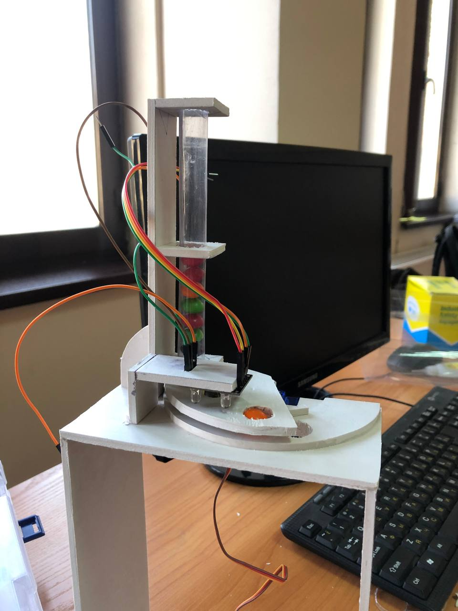

# About
This is a fun Arduino project that sorts skittles based on their colors and sends them to predefined spots (defined with angles) 

# Installation
Follow these steps to run and deploy code into your Arduino chip:
1. [Install](https://support.arduino.cc/hc/en-us/articles/360019833020-Download-and-install-Arduino-IDE) Arduino IDE 
2. [Install](https://www.arduino.cc/reference/en/libraries/servo/) the required Servo library 
3. Load the code into Arduino
4. Have fun!
